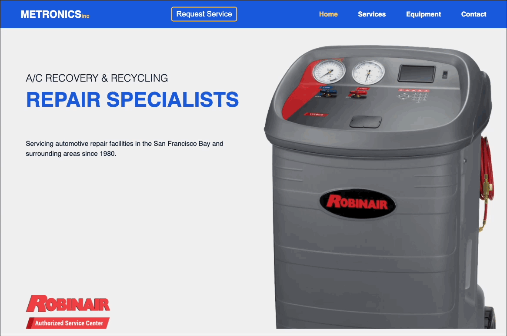
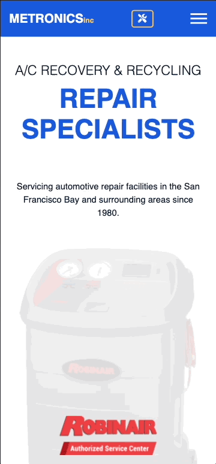

# METRONICS OFFICIAL WEBSITE

[//]: # (![Licence]&#40;https://img.shields.io/github/license/profjjk/metronics-crm-webapp&#41;)

---

## PROJECT SUMMARY
The company’s first-ever website where customers can learn about the company, submit online requests for service, and browse equipment for sale. Built using JavaScript, Node.js, Express.js, JQuery, SCSS/Sass, MongoDB/Mongoose, rendered using the Handlebars templating engine, and deployed on AWS.

## TECHNOLOGIES USED
- **FRONT END**
    - [jQuery](https://jquery.com/), [Handlebars.js](https://handlebarsjs.com/), [Sass](https://sass-lang.com/), [Axios](https://axios-http.com/docs/intro)
- **BACK END**
    - [Node.js](https://nodejs.org/en/),  [Express.js](https://expressjs.com/), [MongoDB](https://www.mongodb.com/), [Mongoose.js](https://mongoosejs.com/)

## MOBILE RESPONSIVE

